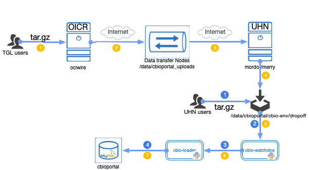

# Loading Study Data to cbioportal.ca
## Introduction
This document outlines the steps you will need to follow to load your study data into cbioportal.ca. The data flow diagram below provides the information about the inputs and outputs of each process.



## General Overview
Getting your study data automatically loaded into cBioPortal requires four steps:

1. [Prepare your study](#prepare-your-study)
2. [Validate your study](#validate-your-study)
3. [Archive your study](#archive-your-study)
4. [Load your study](#load-your-study)

## Prepare your study 
A study needs to be loaded in cBioPortal can basically consist of a directory where all the data files are located. 
Each *data* file needs a *meta* file that refers to it and both files need to comply with the format required for the specific data type. The format and fields expected for each file are documented in the [File Formats page](https://docs.cbioportal.org/5.1-data-loading/data-loading/file-formats#introduction) on the cBioPortal web site. Below is an example of the files in such a directory.

```
dir
|-meta_study.txt
|-meta_cancer_type.txt -> cancer_type.txt
|-meta_clinical.txt -> data_clinical.txt
|-meta_[expression|mutations|CNA|etc] -> data_[expression|mutations|CNA|etc]
```
#### Rules
There are a few rules you will need to follow:
- meta_study, meta_clinical and respective clinical data files are the only **mandatory** files.
- cancer type files can be mandatory if the study is referring to a cancer type that does not yet exist in the DB.
- meta files can be named anything, as long as it starts or ends with name 'meta'. (E.g. meta_test, meta.test, test.meta are all fine) metal_test and metastudy are wrong.
- data files can be named anything and are referenced by the property `data_filename` set in the meta file. 

## Validate your study
Once all files are in place and follow the proper format, it is recommended that you validate your files using a local staging instance. You can skip this step if you do not have any local instance running. The validation has been integrated into the cbioportal data loading python script. 
The importing script validates the data and then loads it if the validation succeeds. 

## Archive your study
To create a tar.gz archive from your study folder you can use the following command. Currently, only the tar.gz file format is supported.
```
tar zcvf study_name.tar.gz ./study_folder
```

## Load your study
To load your study into cBioPortal, all you need to do is drop your archived data file into the designated drop off sites. 

Currently, we have two dropoff sites:
- OICR Users: /data/cbioportal_uploads on ociwire transfer data nodes
- UHN Users: /data/cbioportal/cbio-env/dropoff on merry

The cbio watchdog, a python module running as a background process, will pick it up and execute the importing script of cBioPortal. This script first validates the data and, if the validation succeeds, it starts loading the data. If any errors occur during the validiting or loading, they are logged for troubleshooting. If all goes well, your study should become availabe at cbioportal.ca. All dropoffs will be deleted after the loading process is finished.
#### Notes
For a new study, you will need to contact your project manager to help with the following:
 1. registering your new study with the UHN KeyCloak Server 
 2. granting you access to the new study 
